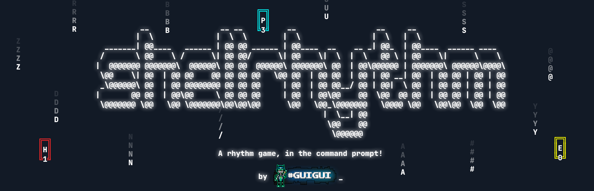

# IMPORTANT WARNING TO ANYONE CHECKING OUT THIS BRANCH

This is a rewrite done using the [blessed](https://github.com/jquast/blessed/) package!
(Yes, I know, rewrite of a beta, [I'm used to it at this point](https://twitter.com/_GuiguiYT/status/1591835268595720192).)

Every script that comes from the `master` branch has been removed. We've been starting up fresh, and now we don't need them anymore!

## Status

Title screen: `98%` (only needs a bit of polish and access to the editor)<br/>
Chart selector: `55%` (needs to add more information)<br/>
Gameplay: `90%` (Missing the results screen)<br/>
Editor: `0%`<br/>
Options: `60%` (Missing link with calibration menu)

# shellrhythm


    

## Gameplay

shellrhythm plays with **your entire keyboard**. (more precisely just the letter keys and aditional punctuation keys, so call that a 30k rhythm game!)<br/>
Simply press the displayed key when the corresponding hit object finishes drawing!

## How to install

At the moment, the only way to play this game is through the source code. **So, how do you play?**

- First, make sure you have [Python 3](https://www.python.org/downloads/) and [git](https://git-scm.com/downloads) installed (If you're using Linux, you probably have these installed)

- Then, `git clone` the project (after having `cd`'d into the folder you want). 
```
git clone https://github.com/HastagGuigui/shellrhythm.git
```

- After that, with `pip` installed, simply do the following command:
```
pip install -r requirements.txt
```

- And then finally, launch the program using the `run.bat` file or in a command prompt in the game's directory:
```
python ./index.py
```
(Launching game.py instead will do nothing.)

## Where are the charts?

By default, there are no charts. Mostly because of copyright reasons, ~~but also because I'm too lazy to finish a chart~~

## How do I make a chart?

Check `/charts/CHARTING.md`, everything you need to know is in there.

## Are there any charts I can download?

You can check out the #shellrhythm-charts on my [Discord server](https://discord.gg/VGxqDahgvY), but I'll most likely update this part with, like, a chartpack or something. I'll just have to wait until charts are available.

## Can I use this project for something?

Sure! It's under the ISC license, so honestly do whatever with it.

## Help! I'm having issues!

If it's a crash or an unexpected behaviour (or even just a suggestion!), open an issue.
If it's just struggle on how to make a chart (like, undocumented stuff), hit me up on [Twitter](https://twitter.com/_GuiguiYT) or on [Discord](https://discord.gg/VGxqDahgvY) (this is a link to my server).

----
© #Guigui 2022
